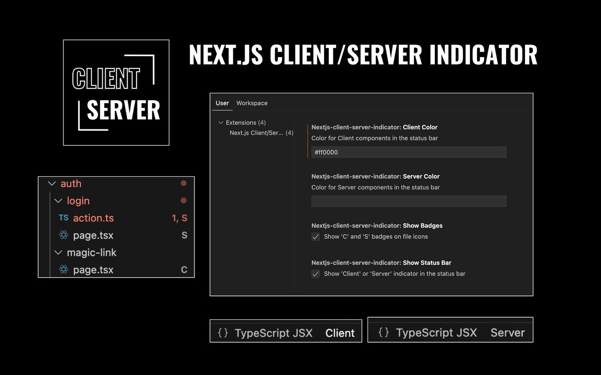

# Next.js Client/Server Indicator

This Visual Studio Code extension provides visual indicators for Next.js projects, showing whether a file is a client-side or server-side component, and detecting routes for Next.js 13+ app directory structure.

## Screenshot

## Demo Video

Check out our demo video to see the extension in action:

## Features

- Status bar indicator showing "Client" or "Server" for Next.js components.
- File badges ('C' for Client, 'S' for Server) on file icons.
- Route detection for Next.js 13+ app directory structure.
- Works with TypeScript and JavaScript files.
- Automatically updates as you switch between files.

## How it works

The extension analyzes the content of your current file:
- If it contains `'use client'` or `"use client"`, it's marked as a Client component.
- Otherwise, it's considered a Server component.
- For files within the `app` directory, the extension detects and displays the corresponding route.
- File icons are decorated with 'C' or 'S' badges to indicate component type.

## Requirements

- Visual Studio Code v1.60.0 or higher
- Next.js project (optimized for Next.js 13+ with app directory structure)

## Extension Settings

This extension contributes the following settings:

* `nextjs-client-server-indicator.showBadges`: Enable/disable 'C' and 'S' badges on file icons (default: true).
* `nextjs-client-server-indicator.showStatusBar`: Enable/disable 'Client' or 'Server' indicator in the status bar (default: true).
* `nextjs-client-server-indicator.clientColor`: Set the color for Client components in the status bar (default: "").
* `nextjs-client-server-indicator.serverColor`: Set the color for Server components in the status bar (default: "").

Note: After changing these settings, you will be prompted to reload the VS Code window for the changes to take full effect.

## Release Notes

See the [CHANGELOG.md](CHANGELOG.md) file for detailed release notes.

## Contributing

Contributions are welcome! Please feel free to submit a Pull Request.

## License

This project is licensed under a custom license that allows free personal use but requires contacting the author for commercial use. See the [LICENSE.txt](LICENSE.txt) file for details.

For commercial use inquiries, please contact the author (Chris Lally) to obtain a commercial license.